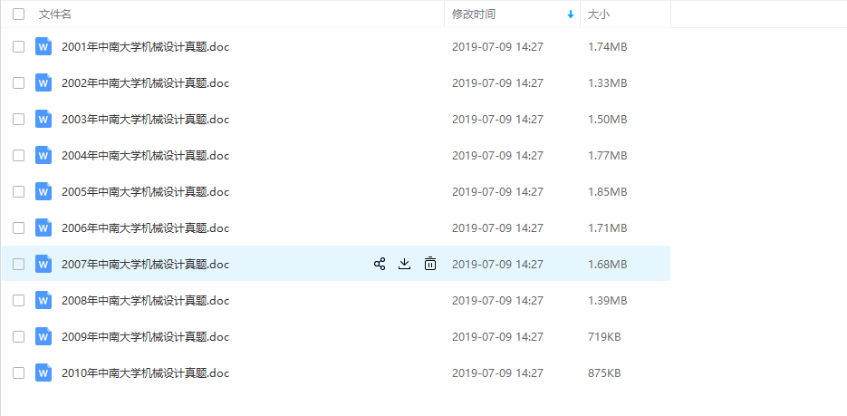
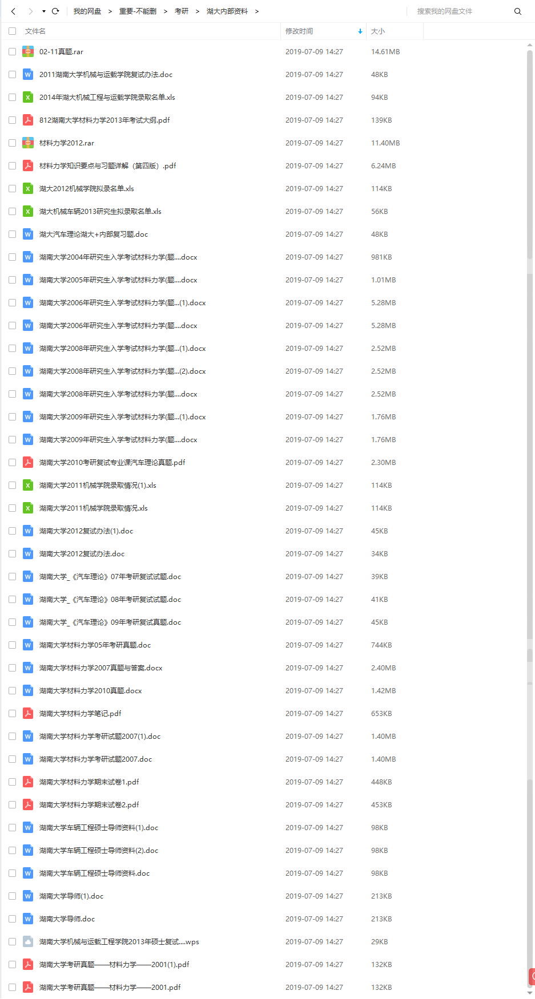

[TOC]
# 机械专业考研资料
因为今天又收到了有小伙伴发邮件要考研资料（在知乎上留过邮箱，以前也有几个跟我要过，都给过了，不知道考的怎么样），因此这里把我以前的资料分享一下，里面是一些中南大学机电工程学院的考研资料，也有一些其他大学的考研资料：上海大学、湖南大学

****
**需要注意的是：本人是15级考研的，18年硕士已经毕业了，资料也是15年的资料，没有再更新，中南大学现在的夏令营招收硕士名额占了很多，而且听我一个学弟说现在中南大学的专业课也考得更难了，所以这些资料仅供参考，不负任何责任，也不收取任何费用，这里的很多资料也是我那时候买的，因为本科的时候班级有打印机，可以扫描，后来就把资料扫描了一下； 还有就是我硕士毕业后就转到别的专业了，不再从事机械专业的研究，因此也不回答什么问题。**
****

## 下载

**如果下载链接失效，请直接发起一个Issue，或者联系邮箱：shawyongqian@gmail.com**
下载地址：

链接：https://pan.baidu.com/s/1D5UdxEnn5Yeb2-P9j48iKw 

提取码：8ria 

****

## 资料总目录

## 中南大学资料
中南大学的资料是比较全的，因为我是考的中南，**里面也有很多我自己整理的知识点，根据真题整理的，书越读越薄，最后只整理成几张A4纸**

## 湖南大学

## 经验分享
我现在已经转专业在读博士了，分享一下那时候考研的经历，加油是一定的，这个不说，还有一个非常重要的就是，心态一定要好，紧张肯定是要有的，但是要把压力变为动力，不要怕。我们那时候考研的时候，一伙人笑着去考试，一伙人笑着考回来，不管考得怎么样，都很正能量，大家心态都很好，最后我们有好几个(一个手数不过来)人都一起上了中南，光在同一个实验室的就有3人。

还有就是一定要多讨论，你以为你学会了，能讲出来不？能让别的不懂的也学懂不？能的话，你就是真的懂了，不要怕分享，怕别人学到了，只有一起多讨论，大家才能共同进步。

还有很重要的一点就是要多总结，这不是在扯淡，像数学和专业课，一定要多总结，从原来很厚的一本书，到最后要总结成十多张，到几张手写的A4纸。这样才算真的学会了，不要到了快考试了，还是很厚的一本书在复习。

公式要背好，我那时候是每天到自习室第一件事就是先把公式背一遍，当然我的记忆力是真的差的不行，所以每天背一遍，考试也还是忘了
